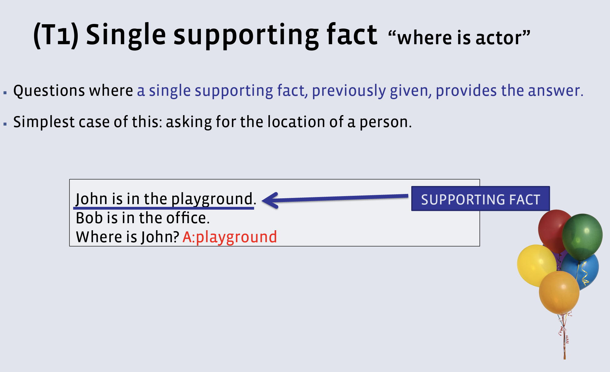
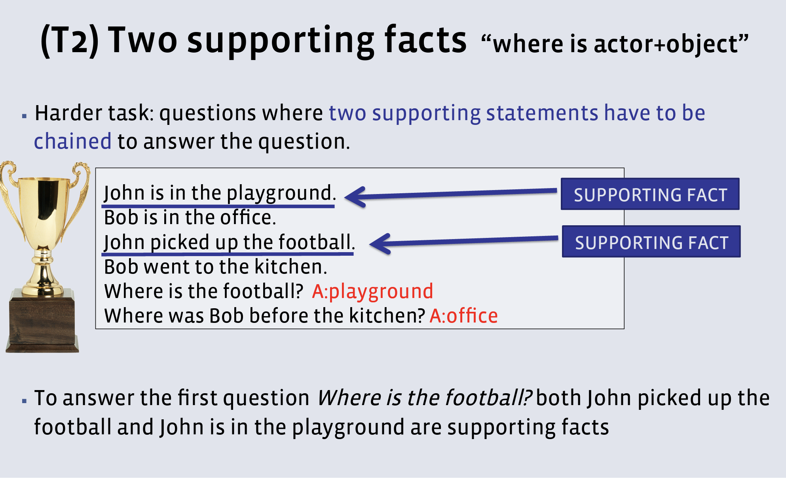
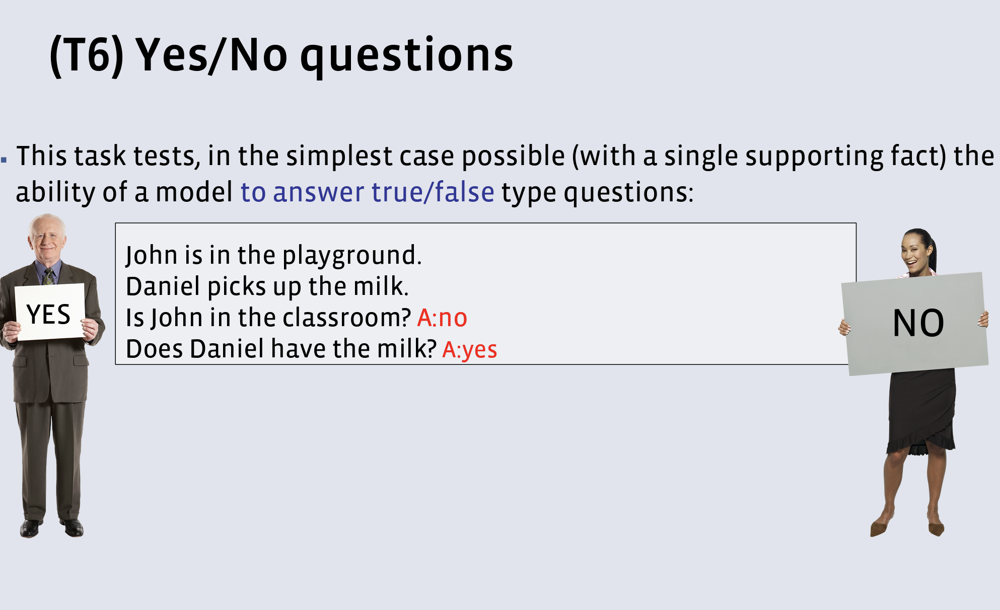
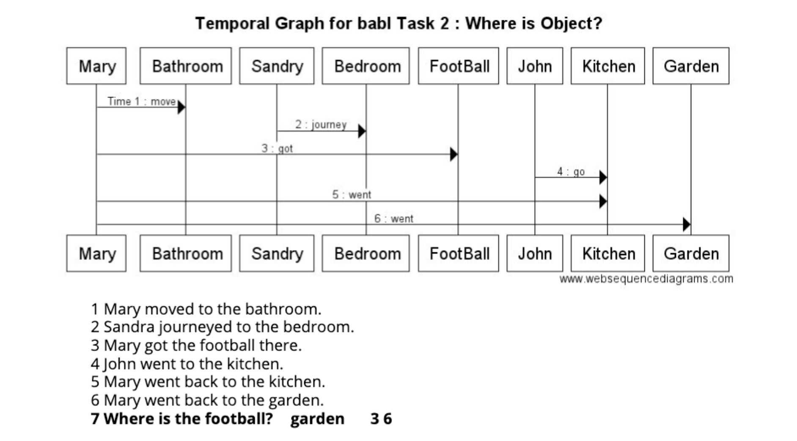

# Temporal Graph for Babi QA Tasks

Goal to solve several [Facebook AI Research(FAIR)'s babi QA tasks](https://research.facebook.com/research/babi/) using a novel approach based on temporal graph traversal.

The tasks are described in detail in the paper : [Towards AI Complete Question Answering: A Set of Prerequisite Toy Tasks](TOWARDS_AI-COMPLETE_QUESTION_ANSWERING-A_SET_OF_PREREQUISITE_TOY_TASKS.pdf)
[Artificial Tasks for AI](http://www.thespermwhale.com/jaseweston/babi/abordes-ICLR.pdf) Each task checks one skill that a reasoning system should have. Performing well on all of them is a pre-requisite for any system aiming at understanding language and able to reason. 

## Project Scope 
To solve 3 of 20 QA tasks (https://github.com/facebook/bAbI-tasks)

| # |   Task                                       |   Class name      |
|---|----------------------------------------------|-------------------|
| 1 |  Basic factoid QA with single supporting fact|    WhereIsActor   |
| 2 |  Factoid QA with two supporting facts        |    WhereIsObject  |
| 6 |  Yes/No questions                            |    IsActorThere   |

## Project Overview
1. Construction of temporal graph to represent the activities of actors in the story
 + Parse the input dataset-(facts of a task) to extract (timestamp, verb, pos, lemma) using Stanford CoreNLP Parser
 + Build the graph where Nodes represent subject & objects, Edges represent verb actions associating subject to object using python networkx module 
 + Visualize graph using matplotlib.pyplot
2. Answering questions by traversing graph.
 + Parse the questions to identify subject/object and locate the corresponding node in graph
 + Use Word Embedding and K-Means clustering on input dataset, to provide semantic heuristic to graph traversal algorithm in order to distingish verb actions which associate subject-object using gensim 
   Clustered verb actions annotated into classes: attach, detach, transport
 + Traverse the graph to find the answers
3. Interactive mode to provide text2speech feedback while parsing stories using espeak accompained with intuitive graphs which present the state of graph model

## Project Demo : https://www.youtube.com/watch?v=WnN6i4ODGHM
## Project Pipeline : [How To Guide](https://github.com/raviraju/NLP_QA_Project/blob/master/HowToGuide.md)

## Project Structure
1. `src\`              : source code
2. `tasks_1-20_v1-2\`  : set of 20 tasks for testing text understanding and reasoning in the bAbI project
 + http://www.thespermwhale.com/jaseweston/babi/tasks_1-20_v1-2.tar.gz
3. `input\`            
 + *_train.txt - tasks_1-20_v1-2/en-10k/ 10,000 training examples
 + *_factsOnly.txt - files which is filtered to have just facts of stories
 + *_POS_Lemma.jl - Part of Speech and Lemma identified
4. `models\`  : word2vec binary model files using gensim
5. `clusters\`  : clusters computed using k-means algorithm
6. `verbMapping\`  : identify relationship between various clusters
7. `annotatedVerbs\`  : verb action clusters annotated with class names(attach, detach, transport)

## Setup
1. Setup Stanford CoreNLP server
  1. Download and extract Core NLP Server
     http://stanfordnlp.github.io/CoreNLP/#download
  2. Start the server on Port 9000  
     `java -mx4g -cp "*" edu.stanford.nlp.pipeline.StanfordCoreNLPServer -port 9000`
     http://localhost:9000/
  3. [Test Sample](corenlp.png)
2. Python wrapper for Stanford CoreNLP : https://github.com/smilli/py-corenlp
3. Espeak https://ports.macports.org/port/espeak-ng/, Python Espeak https://github.com/relsi/python-espeak
4. GenSim : http://radimrehurek.com/gensim/install.html
5. K-Means Clustering : http://scikit-learn.org/stable/install.html

# Team
| Module               | Description                                                   |   Owner    |
|------------------------|---------------------------------------------------------------|-------------------|
| babiparser.py	     | Generating the NER and POS for the given dataset		 | Aditya R Desai    |
| babigraph.py          | Creating a story graph timeline for Q&A(1 Supp & YES/NO)  | Aditya R Desai    |
| babigraph.py::BabiGraph | Reasoning based on 2 Supporting facts | Thamme Gowda    |
| babigraph.py::ActionClassifier | Classifying Actions | Thamme Gowda, Ravi Raju Krishna |
| get_facts.py         | To extract fact sentences(except questions) from all stories of a task | Ravi Raju Krishna |
| word2vec_cluster.py | Clustering of facts using word2vec distributed representation | Ravi Raju Krishna |
| classify_verb_lemma.py | Classify lemma verb actions into categories based on entities they connect | Ravi Raju Krishna |
| babigraph.py-espeak | enabled interactive mode with text-to-speech capability using espeak python | Ravi Raju Krishna |
